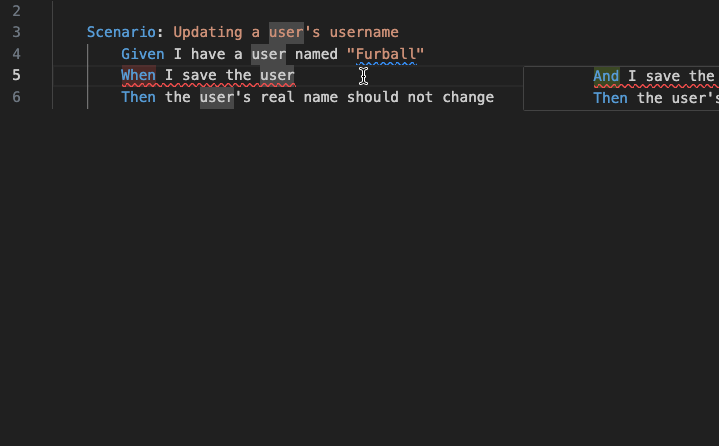

# Step Forge

Step Forge is a typed wrapper around the Cucumber library. It provides an opinionated way to define steps, work with scenario state, and enforce dependencies between steps.

This is just a primer, see the [official documentation site](https://step-forge.com) for more information.

## Installation

```bash
npm install @step-forge/step-forge
```

## Getting Started

### Setting Up World State

```ts
// features/steps/world.ts
import { setWorldConstructor } from "@cucumber/cucumber";
import { BasicWorld } from "@step-forge/step-forge";

export interface GivenState {
  user: string;
}

export interface WhenState {
  name: string;
}

export interface ThenState {}

setWorldConstructor(BasicWorld<GivenState, WhenState, ThenState>);
```

### Defining Steps

This defines a `given` step that doesn't need input variables or dependencies.

```ts
// features/steps/common.ts
import { givenBuilder } from "@step-forge/step-forge";

type GivenState = {
  user: string;
};

givenBuilder<GivenState>()
  .statement("a user")
  .step(() => {
    return {
      user: "John Doe",
    };
  })
  .register();
```

This creates a cucumber step that conceptually looks like this:

```ts
Given("a user", function (this: World) {
  this.given.merge({
    user: "John Doe",
  });
});
```

Not very exciting if you are used to cucumber, but it gets better as this get more complex.

#### Defining Steps with Statement Variables

Let's create a similar step that takes the name as a variable instead of hardcoding it.

```ts
// features/steps/common.ts
import { givenBuilder } from "@step-forge/step-forge";

type GivenState = {
  user: string;
};

givenBuilder<GivenState>()
  .statement((userName: string) => `a user named ${userName}`)
  .step(({ variables: [userName] }) => {
    return {
      user: userName,
    };
  })
  .register();
```

Here you can see that you can pass a template function to the statement that will be used to generate the statement for the cucumber step. Additionally, the `variables` array is strongly typed to match the variables provided in the statement function.

> Note: Right now only `string` variables are supported, but we're working to improve this.

This creates a cucumber step that conceptually looks like this:

```ts
Given("a user named {name}", function (this: World, name: string) {
  this.given.merge({
    user: name,
  });
});
```

#### Defining Steps with Dependencies

Now let's added other scenario dependencies to the step. Let's assume we have another step that sets the user's real name into context, and now we want to give them a user name in our step.

```ts
// features/steps/common.ts
import { givenBuilder } from "@step-forge/step-forge";

type GivenState = {
  realName: string;
  user: {
    name: string;
    realName: string;
  };
};

givenBuilder<GivenState>()
  .statement((userName: string) => `a user named ${userName}`)
  // Since this is a given step, only allow dependencies on given state
  // Strongly typed to ensure you can't depend on something not in given state
  .dependencies({ given: { realName: "required" } })
  .step(({ variables: [userName], given: { realName } }) => {
    return {
      user: {
        name: userName,
        // realName is of type `string` and is not possibly undefined since it was required
        realName,
      },
    };
  })
  .register();
```

Now this is getting more interesting. We've added a dependency on the `realName` part of given state. Step Forge strongly types dependencies based on your world state, and properly restricts access based on the step type. Additionally, since `realName` is required Step Forge will fail the scenario if it doesn't exist when the step is run.

This creates a cucumber step that conceptually looks like this:

```ts
Given("a user named {name}", function (this: World, name: string) {
  if (!this.given.realName) {
    fail("given.realName is required, but was not provided");
  }
  this.given.merge({
    user: {
      name,
      realName: this.given.realName,
    },
  });
});
```

#### Complex Dependencies

Now let's add a `then` step to check that the user's realName matches what we expected in the given step.

```gherkin
# features/update-username.feature
Feature: Updating a user's username

  Scenario: Updating a user's username
    Given a real name of "John Doe"
    And a user name of "Furball"
  When I update the username
  Then the user's real name should not change
```

Now let's implement the `then` step.

```ts
// features/steps/common.ts
import { thenBuilder } from "@step-forge/step-forge";

type GivenState = {
  realName: string;
  user: {
    name: string;
    realName: string;
  };
};

type WhenState = {
  user: {
    name: string;
    realName: string;
  };
};

type ThenState = {};

thenBuilder<GivenState, WhenState, ThenState>()
  .statement("the user's real name should not change")
  .dependencies({
    given: { realName: "required" },
    when: { user: "required" },
  })
  .step(
    ({
      given: { realName: expectedRealName },
      when: { user: updatedUser },
    }) => {
      expect(updatedUser.realName).toEqual(expectedRealName);
      // Then steps can return void if they are not adding anything to `then` state
    }
  )
  .register();
```

Even though we have complex dependencies across multiple parts of state, Step Forge ensures that the dependencies are properly enforced. It also provides type safety ensuring that the step can't depend on something from state that isn't explicitly declared.

### Simpler Step Definitions

> Note: Defining steps this way currently doesn't work with the vs code extension. We're working to improve this.

Some people find the builder syntax to be a bit verbose, having to provide the generics for `GivenState`, `WhenState`, and `ThenState`. If you prefer a simpler syntax you can export your own definitions that have some of it built in.

```ts
// features/steps/common.ts

export const Given = givenBuilder<GivenState>().statement;
export const When = whenBuilder<GivenState, WhenState>().statement;
export const Then = thenBuilder<GivenState, WhenState, ThenState>().statement;
```

You can now define your steps like this:

```ts
// features/steps/user.ts
import { Given } from "./common";

// You can now start your definition with the statement directly, without having to provide GivenState or chain through the builder.
Given("a user")
  .dependencies({ given: { realName: "required" } })
  .step(({ given: { realName } }) => {
    return {
      user: {
        realName,
      },
    };
  })
  .register();
```

### Compile Time Gherkin Analysis

> Note: These features are currently only available in the `@step-forge/step-forge-vscode`VS code extension.

Hopefully you are excited about the strong typing and dependency enforcement that Step Forge provides. But there is more to it than just that. Since we each steps declares its dependencies, and we know what it sets in state from its `return` type, Step Forge can analyze your Gherkin scenarios and provide errors if there are unsatisfied dependencies.

For instance, take the following steps and scenario:

```ts
// features/steps/user.ts
import { Given } from "./common";

type GivenState = {
  name: string;
  user: {
    name: string;
  };
};

Given((name: string) => `a user named ${name}`)
  .step(({ variables: [name] }) => {
    return { name };
  })
  .register();

When("I save the user")
  .dependencies({ given: { user: "required" } })
  .step(({ given: { user } }) => {
    // save the user
  })
  .register();
```

```gherkin
# features/update-username.feature
Feature: Updating a user's username

  Scenario: Updating a user's username
    Given a user named "Furball"
    # This step will show a compilation error because the given step sets "name", but the when step depends on "user"
    When I save the user
    Then the user's real name should not change
```

#### Autocomplete

Additionally when adding a step to a feature file, if the step has unfulfilled dependencies, the extension will show a list of steps that can be used to fulfill the dependencies.


